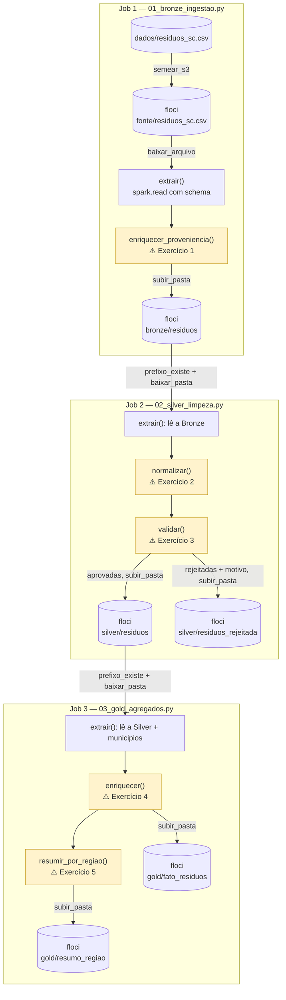
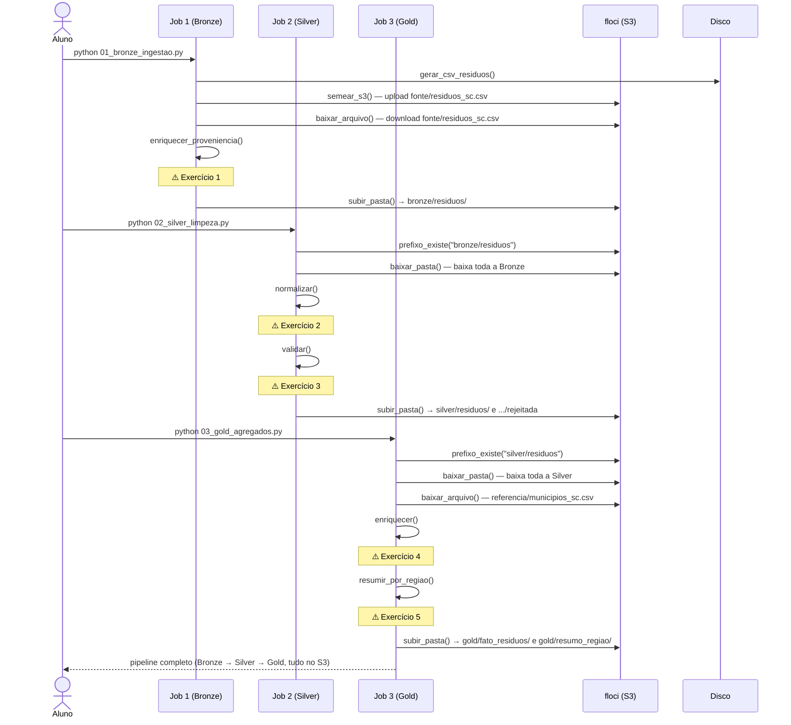

# Exercício — arquitetura medalhão com AWS S3

Cinco exercícios, espalhados por três jobs independentes — a mesma mecânica do exercício [100% local](../PYSPARK-MEDALHAO/EXERCICIOS_MEDALHAO.md) e do exercício [com Azure Blob](../PYSPARK-MEDALHAO-AZURE-BLOB/EXERCICIOS_CHUVA.md). Aqui cada camada vive no S3 (emulado pelo floci). O dado é coleta de resíduos sólidos (toneladas totais e recicláveis) de um trimestre, nas mesmas dez cidades de SC.

Todos os gabaritos foram conferidos em Python puro contra o dado gerado com a semente fixa do job de Bronze.

## O que precisa ser construído





## Como rodar

```powershell
docker compose up -d --wait
.\.venv\Scripts\python.exe verificar_ambiente.py
.\.venv\Scripts\python.exe 01_bronze_ingestao.py
```

Enquanto uma função não estiver completa, ela devolve `None`, e o job para com um `AttributeError`. Rodar um job sem que o anterior tenha gravado a sua camada **no S3** também para, com uma mensagem clara.

---

## O dado

Leituras diárias de coleta de resíduos (toneladas totais e toneladas recicláveis dentro desse total), um trimestre inteiro (92 dias), nas dez cidades de SC — uma leitura por cidade por dia. Gerado com semente fixa (`random.Random(53)`), com ~5% de sujeira: município ausente ou em minúsculo, total e reciclável trocados (reciclável maior que o total), total negativo, total fora de uma faixa física plausível, e uma duplicata.

---

## Job 1 — Bronze (`01_bronze_ingestao.py`)

### 1. Proveniência

Acrescente `arquivo_origem` (`F.lit("fonte/residuos_sc.csv")`) e `ingerido_em` (`F.current_timestamp()`) — sem validar nada.

**Resposta esperada:** 921 linhas na Bronze (idêntico ao CSV bruto).

<details>
<summary>Gabarito</summary>

```python
def enriquecer_proveniencia(bruto: DataFrame) -> DataFrame:
    return (
        bruto
        .withColumn("arquivo_origem", F.lit("fonte/residuos_sc.csv"))
        .withColumn("ingerido_em", F.current_timestamp())
    )
```
</details>

---

## Job 2 — Silver (`02_silver_limpeza.py`)

### 2. Normalizar

`municipio` maiúsculo/trim, `data` para `date`, `dropDuplicates` em `["leitura_id", "data", "municipio"]`.

**Resposta esperada:** `920` linhas (1 duplicata removida de 921 lidas).

<details>
<summary>Gabarito</summary>

```python
def normalizar(bronze: DataFrame) -> DataFrame:
    return (
        bronze
        .withColumn("municipio", F.upper(F.trim(F.col("municipio"))))
        .withColumn("data", F.to_date("data", "yyyy-MM-dd"))
        .dropDuplicates(["leitura_id", "data", "municipio"])
    )
```

Só 1 duplicata neste dado (contra 3–4 nos outros exercícios da série) — o gerador usa a mesma probabilidade de duplicar (~0,4% das linhas), então a diferença é só o acaso do sorteio com uma semente diferente. Não leia significado nenhum na variação; é o tipo de ruído que uma amostra pequena sempre tem.
</details>

### 3. Validar

`regra_valida` = `F.coalesce` de quatro condições: município válido, `toneladas_reciclavel <= toneladas_total`, `toneladas_total` em `[0, 500]`, `toneladas_reciclavel` em `[0, 500]`. Motivo em ordem: município inválido, reciclável maior que o total, total fora da faixa, e o que sobrar é reciclável fora da faixa.

**Resposta esperada:** 856 aprovadas, 64 rejeitadas.

```
total fora da faixa fisica (0 a 500)         47
reciclavel maior que o total                  12
municipio invalida ou ausente                  5
reciclavel fora da faixa fisica (0 a 500)      0
```

<details>
<summary>Gabarito</summary>

```python
def validar(normalizado: DataFrame) -> tuple[DataFrame, DataFrame]:
    nomes_validos = [m.upper() for m in NOMES_MUNICIPIOS]

    regra_valida = F.coalesce(
        F.col("municipio").isin(nomes_validos)
        & (F.col("toneladas_reciclavel") <= F.col("toneladas_total"))
        & F.col("toneladas_total").between(0, 500)
        & F.col("toneladas_reciclavel").between(0, 500),
        F.lit(False),
    )

    rejeitadas = normalizado.filter(~regra_valida).withColumn(
        "motivo",
        F.when(~F.col("municipio").isin(nomes_validos), "municipio invalida ou ausente")
         .when(F.col("toneladas_reciclavel") > F.col("toneladas_total"), "reciclavel maior que o total")
         .when(~F.col("toneladas_total").between(0, 500), "total fora da faixa fisica (0 a 500)")
         .otherwise("reciclavel fora da faixa fisica (0 a 500)"),
    )
    aprovadas = normalizado.filter(regra_valida)
    return aprovadas, rejeitadas
```

Repare que **47 das 64 rejeições** vêm de `toneladas_total` fora da faixa `[0, 500]` — bem mais do que o ~1% que a sujeira injetada de propósito (o valor fixo `650.0`) sozinha explicaria. O motivo: cidades grandes como Joinville partem de uma base de ~480 t/dia, e o ruído aleatório (`gauss(1.0, 0.10)`) às vezes empurra o valor "limpo" para além de 500 por acaso, sem nenhuma sujeira envolvida. É uma lição por si só: **o limiar de uma regra de validação também é uma decisão de projeto**, não só um número de bom senso — 500 parecia uma folga generosa até o dado real (uma cidade grande, um dia de coleta acima da média) provar o contrário. Em produção, esse tipo de "falso positivo" de validação é descoberto assim: olhando a distribuição real antes de fixar o limiar, não depois.

`reciclavel fora da faixa fisica` nunca dispara sozinho neste dado — toda vez que o reciclável sai de [0, 500], ou o município já era inválido, ou o reciclável já tinha ultrapassado o total (capturado pela regra anterior). A regra continua correta e necessária; ela só nunca "ganha a prioridade" neste conjunto específico de sujeira.
</details>

---

## Job 3 — Gold (`03_gold_agregados.py`)

### 4. Taxa de reciclagem e região

`taxa_reciclagem_pct` = `F.round(toneladas_reciclavel / toneladas_total * 100, 1)`. `faixa_reciclagem`: `"baixa"` (< 15%), `"media"` (≤ 30%), `"alta"` (acima). Depois `join(municipios, on="municipio", how="left")`.

**Resposta esperada:** 856 linhas. Faixas: baixa 258, média 577, alta 21.

<details>
<summary>Gabarito</summary>

```python
def enriquecer(silver: DataFrame, municipios: DataFrame) -> DataFrame:
    return (
        silver
        .withColumn(
            "taxa_reciclagem_pct",
            F.round(F.col("toneladas_reciclavel") / F.col("toneladas_total") * 100, 1),
        )
        .withColumn(
            "faixa_reciclagem",
            F.when(F.col("taxa_reciclagem_pct") < 15, "baixa")
             .when(F.col("taxa_reciclagem_pct") <= 30, "media")
             .otherwise("alta"),
        )
        .join(municipios, on="municipio", how="left")
        .select(
            "leitura_id", "data", "municipio", "regiao",
            "toneladas_total", "toneladas_reciclavel",
            "taxa_reciclagem_pct", "faixa_reciclagem",
        )
    )
```

Como a validação do exercício 3 já garante `toneladas_total >= 0` para toda linha aprovada — e a regra `reciclavel <= total` — a única forma de `toneladas_total` ser exatamente `0` seria um dia sem nenhuma coleta. Isso não aconteceu no dado gerado, então a divisão nunca quebra aqui; mas é o tipo de suposição que vale registrar explicitamente (num comentário, ou num teste) em vez de descobrir em produção no dia em que uma cidade realmente parar a coleta por um feriado.
</details>

### 5. Resumir por região

`leituras`, `toneladas_total_trimestre` (soma, 1 casa), `taxa_reciclagem_media_pct` (média, 2 casas). Ordene decrescente por `toneladas_total_trimestre`.

**Resposta esperada** (toneladas, decrescente):

```
Grande Florianopolis     53153.0 t   17.80%
Vale do Itajai           51770.7 t   18.20%
Norte Catarinense        40463.7 t   18.86%
Oeste Catarinense        16122.6 t   17.13%
Sul Catarinense          15432.6 t   17.85%
Serrana                  11001.5 t   18.76%
```

<details>
<summary>Gabarito</summary>

```python
def resumir_por_regiao(fato: DataFrame) -> DataFrame:
    return (
        fato.groupBy("regiao")
        .agg(
            F.count("*").alias("leituras"),
            F.round(F.sum("toneladas_total"), 1).alias("toneladas_total_trimestre"),
            F.round(F.avg("taxa_reciclagem_pct"), 2).alias("taxa_reciclagem_media_pct"),
        )
        .orderBy(F.desc("toneladas_total_trimestre"))
    )
```

As seis regiões têm taxas de reciclagem média bem próximas (17,1% a 18,9%) — nenhuma se destaca muito das outras. Isso é esperado: a taxa de reciclagem foi gerada com a mesma distribuição (`gauss(0.18, 0.06)`) para todas as cidades, sem viés regional embutido no gerador. Se um dia real mostrasse essa mesma uniformidade, valeria desconfiar — ou o dado está errado, ou nenhuma região tem política de reciclagem melhor que a outra, o que também seria uma notícia digna de investigação.
</details>

---

## Desafios, se sobrar fôlego

- **Compare os quatro exercícios de validação da série** (temperaturas, energia, qualidade do ar, chuva, resíduos). Quantos usam uma restrição física entre duas colunas (`A <= B`)? Quantos têm pelo menos uma categoria de motivo com contagem zero? O que esse padrão repetido ensina sobre como desenhar validação de dado em geral?
- **Refaça o exercício 3 com um limiar mais realista.** Em vez de `[0, 500]`, calcule o percentil 99 de `toneladas_total` no dado normalizado (`normalizado.approxQuantile("toneladas_total", [0.99], 0.01)`) e use esse valor como limite superior. Quantas linhas passam a ser aprovadas que antes eram rejeitadas por "total fora da faixa"?
