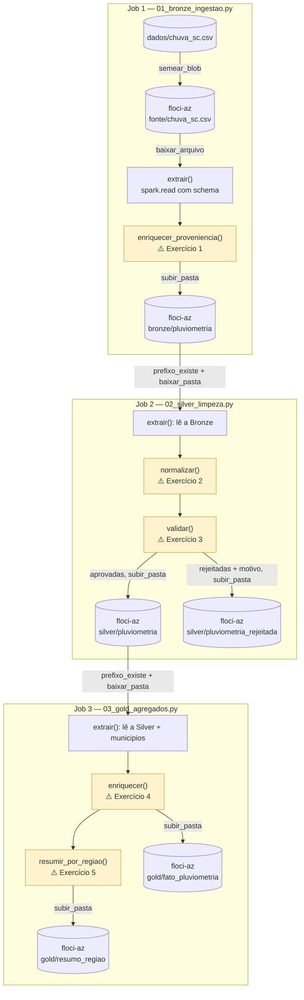
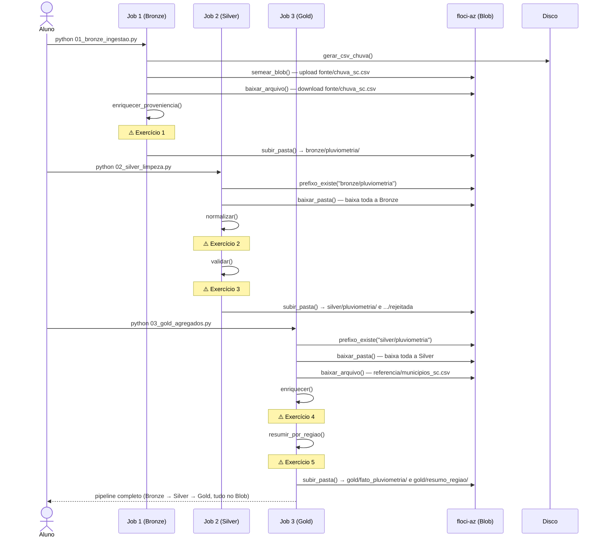

# Exercício — arquitetura medalhão com Azure Blob Storage

Cinco exercícios, espalhados por três jobs independentes — a mesma mecânica do exercício [100% local](../PYSPARK-MEDALHAO/EXERCICIOS_MEDALHAO.md) da pasta ao lado, com uma diferença: cada camada agora vive no Blob Storage (emulado pelo floci-az), não só no seu disco. O dado é pluviometria (chuva e umidade) de um trimestre nas mesmas dez cidades de SC.

Todos os gabaritos foram conferidos em Python puro contra o dado gerado com a semente fixa do job de Bronze.

## O que precisa ser construído





## Como rodar

```powershell
docker compose up -d --wait
.\.venv\Scripts\python.exe verificar_ambiente.py
.\.venv\Scripts\python.exe 01_bronze_ingestao.py
```

Enquanto uma função não estiver completa, ela devolve `None`, e o job para com um `AttributeError` apontando exatamente onde parou. Rodar um job sem que o anterior tenha gravado a sua camada **no Blob** também para, com uma mensagem clara.

O ciclo é o mesmo dos outros exercícios: ler o enunciado (aqui e na *docstring*), escrever o código no lugar do `# TODO`, rodar aquele job, comparar com a resposta esperada, e só então abrir o gabarito.

---

## O dado

Leituras diárias de chuva (mm) e umidade relativa (%), um trimestre inteiro (92 dias), nas dez cidades de SC — uma leitura por cidade por dia. Gerado com semente fixa (`random.Random(43)`), com ~5% de sujeira: município ausente ou em minúsculo, chuva negativa ou fora de uma faixa física plausível, umidade fora de 0–100%, e algumas duplicatas.

---

## Job 1 — Bronze (`01_bronze_ingestao.py`)

### 1. Proveniência

Igual ao exercício 1 do laboratório local: acrescente `arquivo_origem` (`F.lit("fonte/chuva_sc.csv")`) e `ingerido_em` (`F.current_timestamp()`) — nada de validar ou filtrar.

**Resposta esperada:** 924 linhas na Bronze (idêntico ao CSV bruto).

<details>
<summary>Gabarito</summary>

```python
def enriquecer_proveniencia(bruto: DataFrame) -> DataFrame:
    return (
        bruto
        .withColumn("arquivo_origem", F.lit("fonte/chuva_sc.csv"))
        .withColumn("ingerido_em", F.current_timestamp())
    )
```

Note a diferença em relação ao laboratório local: lá, `arquivo_origem` apontava para um caminho de disco (`ARQUIVO_AR.name`); aqui, aponta para o nome do **blob** de origem. A proveniência sempre descreve de onde o dado veio — o formato dessa descrição muda com o armazenamento, mas o motivo de ela existir não.
</details>

---

## Job 2 — Silver (`02_silver_limpeza.py`)

### 2. Normalizar

`municipio` maiúsculo/trim, `data` para `date`, `dropDuplicates` em `["leitura_id", "data", "municipio"]`.

**Resposta esperada:** `920` linhas (4 duplicatas removidas de 924 lidas).

<details>
<summary>Gabarito</summary>

```python
def normalizar(bronze: DataFrame) -> DataFrame:
    return (
        bronze
        .withColumn("municipio", F.upper(F.trim(F.col("municipio"))))
        .withColumn("data", F.to_date("data", "yyyy-MM-dd"))
        .dropDuplicates(["leitura_id", "data", "municipio"])
    )
```
</details>

### 3. Validar

`regra_valida` = `F.coalesce` de três condições: município válido, `chuva_mm` em `[0, 200]`, `umidade_pct` em `[0, 100]`. Motivo em ordem: município inválido, chuva fora da faixa, e o que sobrar é umidade fora da faixa.

**Resposta esperada:** 885 aprovadas, 35 rejeitadas.

```
chuva fora da faixa (0 a 200)      18
umidade fora da faixa (0 a 100)    10
municipio invalida ou ausente       7
```

<details>
<summary>Gabarito</summary>

```python
def validar(normalizado: DataFrame) -> tuple[DataFrame, DataFrame]:
    nomes_validos = [m.upper() for m in NOMES_MUNICIPIOS]

    regra_valida = F.coalesce(
        F.col("municipio").isin(nomes_validos)
        & F.col("chuva_mm").between(0, 200)
        & F.col("umidade_pct").between(0, 100),
        F.lit(False),
    )

    rejeitadas = normalizado.filter(~regra_valida).withColumn(
        "motivo",
        F.when(~F.col("municipio").isin(nomes_validos), "municipio invalida ou ausente")
         .when(~F.col("chuva_mm").between(0, 200), "chuva fora da faixa (0 a 200)")
         .otherwise("umidade fora da faixa (0 a 100)"),
    )
    aprovadas = normalizado.filter(regra_valida)
    return aprovadas, rejeitadas
```

Este é o exercício de validação mais simples da série (só três condições, sem nenhuma comparação entre duas colunas como `min <= max` ou `pm25 <= pm10`) — nem toda camada de qualidade de dado precisa de uma restrição física cruzada; às vezes "cada coluna dentro da sua própria faixa" já é suficiente.
</details>

---

## Job 3 — Gold (`03_gold_agregados.py`)

### 4. Classificar e juntar com a região

`faixa_chuva`: `"seco"` (< 1mm), `"moderado"` (≤ 20mm), `"forte"` (acima). Depois `join(municipios, on="municipio", how="left")`.

**Resposta esperada:** 885 linhas. Faixas: seco 576, moderado 165, forte 144.

<details>
<summary>Gabarito</summary>

```python
def enriquecer(silver: DataFrame, municipios: DataFrame) -> DataFrame:
    return (
        silver
        .withColumn(
            "faixa_chuva",
            F.when(F.col("chuva_mm") < 1, "seco")
             .when(F.col("chuva_mm") <= 20, "moderado")
             .otherwise("forte"),
        )
        .join(municipios, on="municipio", how="left")
        .select(
            "leitura_id", "data", "municipio", "regiao",
            "chuva_mm", "umidade_pct", "faixa_chuva",
        )
    )
```

Ao contrário do exercício de qualidade do ar (onde "ruim" nunca acontecia), aqui "forte" é a categoria mais rara mas nada incomum: 144 de 885 leituras (16%) — chuva forte não é exceção em Santa Catarina, é parte normal do trimestre.
</details>

### 5. Resumir por região

`leituras`, `chuva_total_mm` (soma, 1 casa), `dias_chuva_forte` (soma condicional). Ordene decrescente por `chuva_total_mm`.

**Resposta esperada** (mm, decrescente):

```
Vale do Itajai            2160.4  (51 dias de chuva forte)
Norte Catarinense         1414.0  (34 dias de chuva forte)
Grande Florianopolis      1278.9  (30 dias de chuva forte)
Serrana                    528.4  ( 9 dias de chuva forte)
Oeste Catarinense          493.2  (10 dias de chuva forte)
Sul Catarinense            379.4  (10 dias de chuva forte)
```

<details>
<summary>Gabarito</summary>

```python
def resumir_por_regiao(fato: DataFrame) -> DataFrame:
    return (
        fato.groupBy("regiao")
        .agg(
            F.count("*").alias("leituras"),
            F.round(F.sum("chuva_mm"), 1).alias("chuva_total_mm"),
            F.sum(F.when(F.col("faixa_chuva") == "forte", 1).otherwise(0))
                .alias("dias_chuva_forte"),
        )
        .orderBy(F.desc("chuva_total_mm"))
    )
```

O Vale do Itajaí lidera com quase o dobro do total de chuva da segunda colocada — e reúne três cidades (Blumenau, Itajaí, Balneário Camboriú) contra uma ou duas nas outras regiões, então parte da diferença é só "mais estações contribuindo para a soma". Se a pergunta fosse "qual região chove mais por cidade", a métrica certa seria a média, não a soma — o mesmo cuidado de escolher a agregação certa que já apareceu nos exercícios anteriores.
</details>

---

## Desafios, se sobrar fôlego

- **Compare os três exercícios de validação da série** (temperaturas, qualidade do ar, chuva). Um usa uma restrição física entre duas colunas (`min <= max`, `pm25 <= pm10`); este não usa nenhuma. Isso torna a validação "mais fraca"? Justifique com o que cada regra realmente protege.
- **Meça o custo do download por camada.** Cada job baixa a camada anterior inteira do Blob antes de processar, mesmo que a cópia local já exista de uma execução anterior (`baixar_pasta` não verifica cache). Cronometre, dentro de `02_silver_limpeza.py`, quanto tempo o `baixar_pasta(...)` da função `extrair` consome sozinho, e compare com o tempo total do job — o download é a parte cara, ou o processamento? Depois pense: valeria a pena o job pular o download quando a cópia local já existe? Que problema isso criaria se a Bronze tivesse sido reprocessada no meio tempo?
