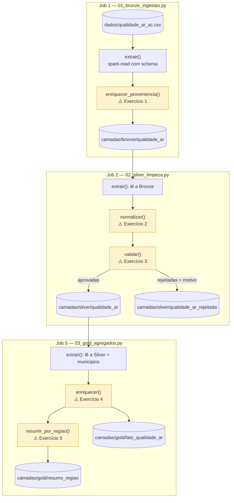
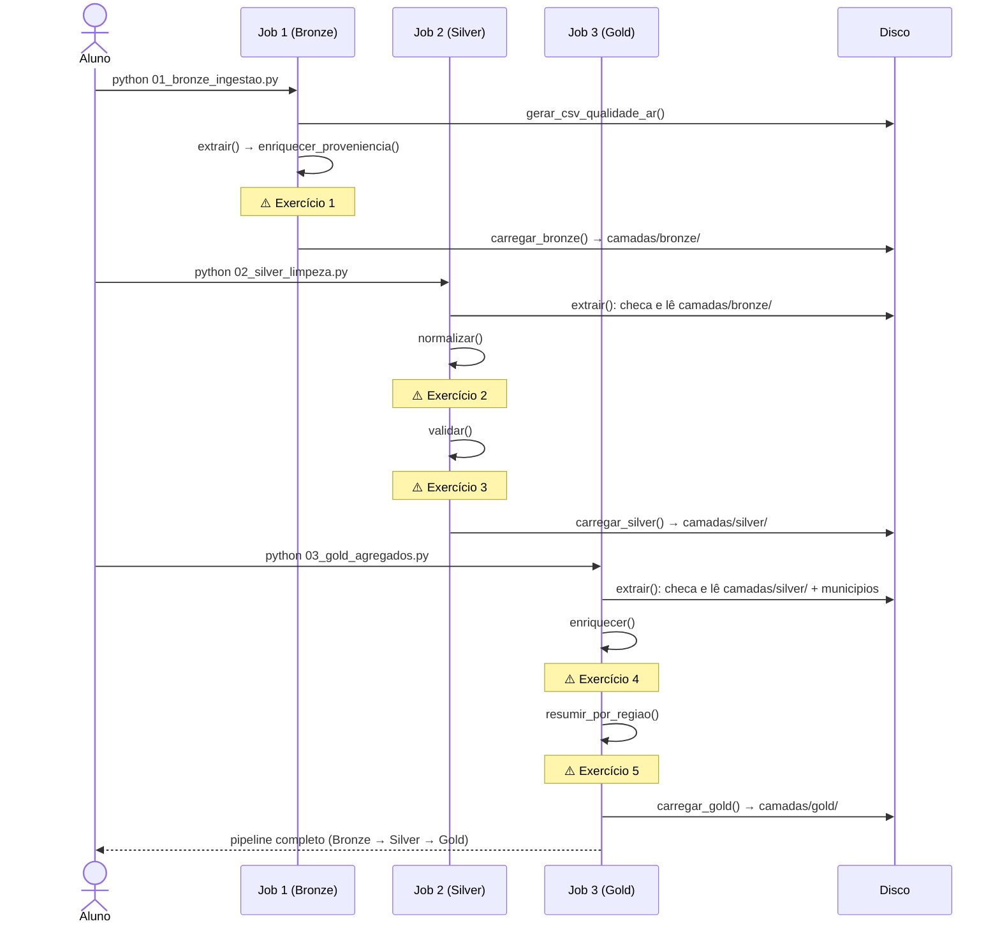

# Exercício — arquitetura medalhão, um job por camada

Cinco exercícios, espalhados por três jobs independentes — um por camada (Bronze, Silver, Gold). É a mesma mecânica dos exercícios de ETL da AULA04: você completa cada script diretamente e roda o job inteiro a cada mudança. A diferença é que aqui **cada camada é um programa separado**, que lê a saída do anterior do disco — não uma função dentro do mesmo script.

Todos os gabaritos foram conferidos em Python puro contra o dado gerado com a semente fixa do job de Bronze — os números abaixo são a saída real, não uma estimativa.

## O que precisa ser construído





## Como rodar

```powershell
.\.venv\Scripts\python.exe verificar_ambiente.py
.\.venv\Scripts\python.exe 01_bronze_ingestao.py
.\.venv\Scripts\python.exe 02_silver_limpeza.py
.\.venv\Scripts\python.exe 03_gold_agregados.py
```

Ou tudo de uma vez, depois que os cinco exercícios estiverem completos:

```powershell
.\.venv\Scripts\python.exe executar_pipeline.py
```

Enquanto uma função não estiver completa, ela devolve `None`, e o job para com um `AttributeError` apontando exatamente onde parou. Rodar um job sem que o anterior tenha gravado a sua camada também para, com uma mensagem clara (`Bronze nao encontrada em ...`) — não é um bug, é a dependência entre jobs sendo explícita.

O ciclo é sempre o mesmo:

1. **Leia o enunciado** aqui e a *docstring* da função correspondente no job.
2. **Escreva o código** no lugar do `# TODO`.
3. **Rode aquele job** (não precisa rodar os três de novo se só mexeu num).
4. **Compare** com a "Resposta esperada".
5. **Só então** abra o bloco `Gabarito` — ele explica o *porquê*, não só o *como*.

---

## O dado

Leituras diárias de qualidade do ar (PM2.5, PM10, monóxido de carbono), um trimestre inteiro (jul–set/2024, 92 dias), nas mesmas dez cidades de SC dos laboratórios anteriores — uma leitura por cidade por dia. Gerado com semente fixa (`random.Random(31)`), com ~5% de sujeira plausível para um sensor de qualidade do ar: município ausente ou em minúsculo, PM2.5 e PM10 trocados (sensor invertido), partículas fora de uma faixa física plausível, CO fora de faixa, e algumas duplicatas.

---

## Job 1 — Bronze (`01_bronze_ingestao.py`)

### 1. Proveniência

Na função `enriquecer_proveniencia`, acrescente duas colunas — **não valide nada aqui**, isso é trabalho da Silver:

- `arquivo_origem`: `F.lit(ARQUIVO_AR.name)`.
- `ingerido_em`: `F.current_timestamp()`.

**Resposta esperada:** 923 linhas na Bronze — **idêntico** ao CSV bruto. A Bronze não filtra nada.

<details>
<summary>Gabarito</summary>

```python
def enriquecer_proveniencia(bruto: DataFrame) -> DataFrame:
    return (
        bruto
        .withColumn("arquivo_origem", F.lit(ARQUIVO_AR.name))
        .withColumn("ingerido_em", F.current_timestamp())
    )
```

O erro mais comum de quem chega da Silver/Gold para a Bronze é "aproveitar" e já filtrar uma linha obviamente quebrada (`pm25` negativo, por exemplo). Resista: a Bronze existe justamente para guardar o dado **como ele chegou**, quebrado e tudo. Se um auditor perguntar "esse número absurdo apareceu quando", a resposta está aqui — se a Bronze já tivesse filtrado, a pergunta não teria resposta.
</details>

---

## Job 2 — Silver (`02_silver_limpeza.py`)

### 2. Normalizar

Na função `normalizar`, escreva:

1. `municipio` para maiúsculo e sem espaço nas pontas.
2. `data` de string para `date`.
3. `dropDuplicates` em `["leitura_id", "data", "municipio"]`.

**Resposta esperada:** `920` linhas depois do dedup (3 duplicatas removidas de 923 lidas da Bronze).

<details>
<summary>Gabarito</summary>

```python
def normalizar(bronze: DataFrame) -> DataFrame:
    return (
        bronze
        .withColumn("municipio", F.upper(F.trim(F.col("municipio"))))
        .withColumn("data", F.to_date("data", "yyyy-MM-dd"))
        .dropDuplicates(["leitura_id", "data", "municipio"])
    )
```

Note que `arquivo_origem` e `ingerido_em` — as colunas que o job da Bronze acrescentou — continuam na tabela depois deste `dropDuplicates`, porque ele opera só nas colunas listadas, não substitui o schema. A Silver limpa conteúdo; proveniência é histórico, e histórico não se apaga por engano.
</details>

### 3. Validar

Na função `validar`, monte `regra_valida` como um `F.coalesce` de quatro condições com `&`:

- `municipio` está em `NOMES_MUNICIPIOS` (em maiúsculo);
- `pm25 <= pm10`;
- `pm25` e `pm10` estão dentro de `[0, 500]`;
- `co_ppm` está dentro de `[0, 50]`.

E a coluna `motivo` nos rejeitados, com uma cadeia de `F.when` nesta ordem: município inválido, depois `pm25 > pm10`, depois faixa física do particulado, e o que sobrar é CO fora da faixa.

**Resposta esperada:** 889 aprovadas, 31 rejeitadas.

```
co fora da faixa (0 a 50)                    11
pm25 maior que pm10                           9
municipio invalida ou ausente                 7
particulado fora da faixa fisica (0 a 500)    4
```

<details>
<summary>Gabarito</summary>

```python
def validar(normalizado: DataFrame) -> tuple[DataFrame, DataFrame]:
    nomes_validos = [m.upper() for m in NOMES_MUNICIPIOS]

    regra_valida = F.coalesce(
        F.col("municipio").isin(nomes_validos)
        & (F.col("pm25") <= F.col("pm10"))
        & F.col("pm25").between(0, 500)
        & F.col("pm10").between(0, 500)
        & F.col("co_ppm").between(0, 50),
        F.lit(False),
    )

    rejeitadas = normalizado.filter(~regra_valida).withColumn(
        "motivo",
        F.when(~F.col("municipio").isin(nomes_validos), "municipio invalida ou ausente")
         .when(F.col("pm25") > F.col("pm10"), "pm25 maior que pm10")
         .when(
             ~F.col("pm25").between(0, 500) | ~F.col("pm10").between(0, 500),
             "particulado fora da faixa fisica (0 a 500)",
         )
         .otherwise("co fora da faixa (0 a 50)"),
    )
    aprovadas = normalizado.filter(regra_valida)
    return aprovadas, rejeitadas
```

A regra `pm25 <= pm10` existe porque PM2.5 é fisicamente um subconjunto de PM10 (partículas de até 2,5 µm cabem dentro da faixa de até 10 µm) — um sensor que reporta o contrário está com defeito ou os canais trocados, não descobriu um fenômeno novo. É o mesmo raciocínio do `temperatura_min <= temperatura_max` do exercício da AULA04: a regra de validação não nasce de estatística, nasce de uma restrição física do fenômeno medido.
</details>

---

## Job 3 — Gold (`03_gold_agregados.py`)

### 4. Classificar e juntar com a região

Na função `enriquecer`, acrescente `faixa_qualidade` e junte com `municipios`:

- `faixa_qualidade`: `"bom"` se `pm25 <= 25`, `"moderado"` se `<= 50`, `"ruim"` acima disso.
- `join(municipios, on="municipio", how="left")`.

**Resposta esperada:** 889 linhas (mesma contagem da Silver aprovada). Faixas: bom 838, moderado 51, ruim 0.

<details>
<summary>Gabarito</summary>

```python
def enriquecer(silver: DataFrame, municipios: DataFrame) -> DataFrame:
    return (
        silver
        .withColumn(
            "faixa_qualidade",
            F.when(F.col("pm25") <= 25, "bom")
             .when(F.col("pm25") <= 50, "moderado")
             .otherwise("ruim"),
        )
        .join(municipios, on="municipio", how="left")
        .select(
            "leitura_id", "data", "municipio", "regiao",
            "pm25", "pm10", "co_ppm", "faixa_qualidade",
        )
    )
```

Nenhuma leitura caiu em "ruim" (pm25 > 50) no trimestre inteiro — o que, para qualidade do ar, é uma notícia **boa**, não um sinal de que a regra está sobrando. Uma categoria com contagem zero continua sendo parte do contrato da tabela: no dia em que um incêndio florestal ou uma inversão térmica severa empurrar o pm25 para cima de 50, a categoria já existe para recebê-la, sem precisar de deploy.
</details>

### 5. Resumir por região

Na função `resumir_por_regiao`, agrupe `fato` por `regiao` e calcule `leituras` (contagem), `pm25_medio` (média de `pm25`, 2 casas) e `dias_moderados_ou_piores` (soma de 1 quando `faixa_qualidade != "bom"`, senão 0). Ordene decrescente por `pm25_medio`.

**Resposta esperada** (µg/m³, decrescente):

```
Sul Catarinense           22.59  (90 leituras, 21 moderados/piores)
Norte Catarinense         19.85  (175 leituras, 21 moderados/piores)
Serrana                   18.03  (89 leituras, 1 moderado/pior)
Vale do Itajai            17.55  (271 leituras, 8 moderados/piores)
Oeste Catarinense         15.42  (87 leituras, 0 moderados/piores)
Grande Florianopolis      14.08  (177 leituras, 0 moderados/piores)
```

<details>
<summary>Gabarito</summary>

```python
def resumir_por_regiao(fato: DataFrame) -> DataFrame:
    return (
        fato.groupBy("regiao")
        .agg(
            F.count("*").alias("leituras"),
            F.round(F.avg("pm25"), 2).alias("pm25_medio"),
            F.sum(F.when(F.col("faixa_qualidade") != "bom", 1).otherwise(0))
                .alias("dias_moderados_ou_piores"),
        )
        .orderBy(F.desc("pm25_medio"))
    )
```

Sul Catarinense e Norte Catarinense empatam em 21 dias moderados ou piores, mas com médias bem diferentes (22,59 vs. 19,85). A tabela por região não mostra isso, mas ao somar por `municipio` dentro de `fato` você vai ver que os dois "empates" têm origens bem diferentes: em Sul Catarinense, os 21 dias são inteiros de uma única cidade (Criciúma é a única do grupo); em Norte Catarinense, 20 dos 21 são de Joinville, e só 1 de Jaraguá do Sul — mesmo a região tendo duas cidades, o problema não está distribuído entre elas. Já no Vale do Itajaí, os 8 dias moderados se dividem quase igualmente entre Itajaí (4) e Blumenau (4). A média por região não conta essa diferença; é por isso que uma tabela Gold de verdade raramente para no primeiro nível de agregação.
</details>

---

## Desafios, se sobrar fôlego

- **Quebre a cadeia de propósito.** Apague a pasta `camadas/bronze/` (ou rode `python 01_bronze_ingestao.py --limpar`) e rode só `02_silver_limpeza.py` sem rodar o job da Bronze antes. Leia a mensagem de erro e confirme que ela diz exatamente qual job rodar, na ordem certa.
- **Meça o custo do reprocessamento parcial.** Depois do pipeline completo, mude só o limiar de `faixa_qualidade` no job da Gold (de 25/50 para outro valor) e rode só `03_gold_agregados.py` de novo — sem tocar na Bronze nem na Silver. Cronometre e compare com rodar o pipeline inteiro. É essa diferença de custo que justifica a arquitetura medalhão em produção: um erro de regra de negócio na Gold não obriga a reingestão dos dados brutos.
- **Compare com o exercício de temperaturas da AULA04.** Lá, normalizar/validar/enriquecer/resumir eram quatro funções dentro do **mesmo** script. Aqui são três **jobs** separados. Liste o que cada arranjo ganha e perde — tempo de execução, isolamento de falha, facilidade de depurar, acoplamento entre etapas.
