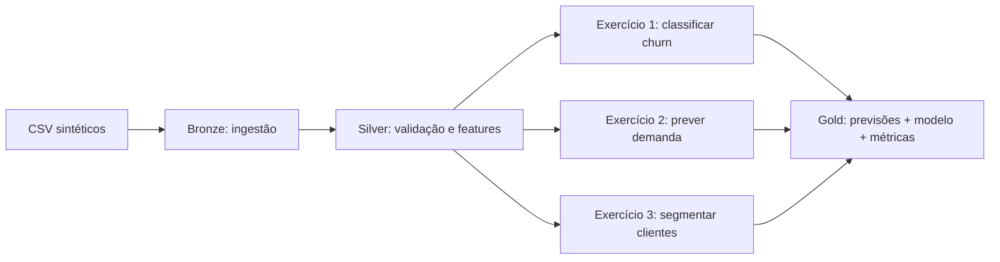

# Exercícios — Spark ML em três casos de uso

Três exercícios no job Gold: classificação, regressão e clusterização. Os jobs Bronze e Silver já vêm completos para preparar as fontes e as features. Complete uma função `TODO` por vez em `03_gold_modelos.py`, execute o job Gold e compare as saídas.

## Fluxo do laboratório



## Como resolver

```powershell
.\.venv\Scripts\python.exe verificar_ambiente.py
.\.venv\Scripts\python.exe 01_bronze_ingestao.py
.\.venv\Scripts\python.exe 02_silver_preparacao.py
.\.venv\Scripts\python.exe 03_gold_modelos.py
```

O job Gold executa os três casos em ordem. Enquanto uma função ainda retorna `None`, a execução para quando tenta desempacotar o resultado; isso é esperado. Resolva os três exercícios e então rode `executar_pipeline.py` para testar as três camadas desde a Bronze.

Para cada exercício:

1. Leia a docstring da função e o enunciado correspondente abaixo.
2. Substitua o bloco `TODO` pela implementação.
3. Rode `03_gold_modelos.py` e confira a previsão, as métricas e o artefato persistido.
4. Abra o gabarito somente depois de tentar a implementação.

O dado é fixo por semente e não contém dados pessoais. A separação treino/teste também usa `seed=42`, então os resultados são reproduzíveis no mesmo ambiente Spark.

---

## Exercício 1 — classificação de churn

Complete `classificar_churn(churn)`.

1. Separe 80% para treino e 20% para teste usando `randomSplit([0.8, 0.2], seed=42)`.
2. Use `VectorAssembler` com `tenure_meses`, `mensalidade`, `chamados_suporte` e `contrato_meses`. **Não inclua `cancelou` nas features**: ela é o rótulo.
3. Monte um `Pipeline` com `LogisticRegression(featuresCol="features", labelCol="cancelou", maxIter=40, regParam=0.05)` e ajuste no treino.
4. Transforme o teste e calcule `areaUnderROC` com `BinaryClassificationEvaluator` e `accuracy` com `MulticlassClassificationEvaluator`.
5. Retorne `(previsoes, modelo, metricas)`, onde `metricas` tem as tuplas `("churn", "area_under_roc", valor)` e `("churn", "acuracia", valor)`.

**Resposta esperada:** execução sem erro; previsões com `cliente_id`, `cancelou`, `prediction` e `probability`; AUC ROC e acurácia entre 0 e 1. A tabela `camadas/gold/previsoes_churn/` contém somente o teste, e o modelo é gravado em `camadas/gold/modelos/churn_logistic_regression/`.

<details>
<summary>Gabarito</summary>

```python
def classificar_churn(churn):
    treino, teste = churn.randomSplit([0.8, 0.2], seed=42)
    assembler = VectorAssembler(
        inputCols=[
            "tenure_meses", "mensalidade", "chamados_suporte",
            "contrato_meses",
        ],
        outputCol="features",
    )
    classificador = LogisticRegression(
        featuresCol="features", labelCol="cancelou", maxIter=40,
        regParam=0.05,
    )
    modelo = Pipeline(stages=[assembler, classificador]).fit(treino)
    previsoes = modelo.transform(teste)

    auc = BinaryClassificationEvaluator(
        labelCol="cancelou", rawPredictionCol="rawPrediction",
        metricName="areaUnderROC",
    ).evaluate(previsoes)
    acuracia = MulticlassClassificationEvaluator(
        labelCol="cancelou", predictionCol="prediction",
        metricName="accuracy",
    ).evaluate(previsoes)
    metricas = [
        ("churn", "area_under_roc", float(auc)),
        ("churn", "acuracia", float(acuracia)),
    ]
    return previsoes, modelo, metricas
```

`LogisticRegression` é supervisionada: aprende a relação entre as features e `cancelou`. O vetor `probability` fornece a probabilidade estimada para cada classe; `prediction` é a classe escolhida pelo limiar padrão. AUC mede ordenação entre classes, enquanto acurácia mede a fração de rótulos previstos corretamente.
</details>

---

## Exercício 2 — regressão da demanda de energia

Complete `prever_demanda(energia)`.

1. Faça a mesma divisão 80/20 com `seed=42`.
2. Monte as features com `temperatura_c`, `dia_semana`, `feriado` e `ocupacao_pct`; o rótulo contínuo é `demanda_mwh`.
3. Monte um `Pipeline` com `VectorAssembler` e `RandomForestRegressor(featuresCol="features", labelCol="demanda_mwh", numTrees=40, maxDepth=6, seed=42)`.
4. Ajuste no treino, transforme o teste e avalie `rmse` e `mae` com `RegressionEvaluator`.
5. Retorne `(previsoes, modelo, metricas)` com `("energia", "rmse_mwh", valor)` e `("energia", "mae_mwh", valor)`.

**Resposta esperada:** a Gold grava `registro_id`, `demanda_mwh` real e `prediction` em `camadas/gold/previsoes_energia/`; o modelo fica em `camadas/gold/modelos/energia_random_forest/`. RMSE e MAE são positivos e estão na unidade de demanda, MWh.

<details>
<summary>Gabarito</summary>

```python
def prever_demanda(energia):
    treino, teste = energia.randomSplit([0.8, 0.2], seed=42)
    assembler = VectorAssembler(
        inputCols=[
            "temperatura_c", "dia_semana", "feriado", "ocupacao_pct",
        ],
        outputCol="features",
    )
    regressor = RandomForestRegressor(
        featuresCol="features", labelCol="demanda_mwh", numTrees=40,
        maxDepth=6, seed=42,
    )
    modelo = Pipeline(stages=[assembler, regressor]).fit(treino)
    previsoes = modelo.transform(teste)
    rmse = RegressionEvaluator(
        labelCol="demanda_mwh", predictionCol="prediction",
        metricName="rmse",
    ).evaluate(previsoes)
    mae = RegressionEvaluator(
        labelCol="demanda_mwh", predictionCol="prediction",
        metricName="mae",
    ).evaluate(previsoes)
    metricas = [
        ("energia", "rmse_mwh", float(rmse)),
        ("energia", "mae_mwh", float(mae)),
    ]
    return previsoes, modelo, metricas
```

Regressão prevê um valor numérico. RMSE penaliza mais os erros maiores; MAE é o erro absoluto médio. Como ambos são expressos em MWh, podem ser interpretados na escala da variável prevista.
</details>

---

## Exercício 3 — clusterização de clientes

Complete `segmentar_clientes(varejo)`.

1. Use `gasto_mensal`, `compras_mes`, `dias_desde_ultima_compra` e `gasto_por_compra` como features.
2. Encadeie `VectorAssembler` (saída `features_brutas`), `StandardScaler` (`withMean=True`, `withStd=True`, saída `features`) e `KMeans` (`k=3`, `seed=42`) num `Pipeline`.
3. Ajuste em todos os clientes, transforme os mesmos dados e leia `trainingCost` do sumário do modelo K-Means.
4. Retorne `(segmentos, modelo, metricas)`, usando `("varejo", "within_set_sum_squared_error", valor)`.

**Resposta esperada:** 1.200 clientes recebem um valor `segmento` entre 0 e 2. O resumo impresso contém três grupos, com contagens somando 1.200. As previsões ficam em `camadas/gold/segmentos_varejo/` e o modelo em `camadas/gold/modelos/varejo_kmeans/`.

Os IDs de cluster são arbitrários: o segmento `0` não é “melhor” ou “menor” que o `1`. A métrica WSSSE tende a diminuir quando `k` cresce, portanto ela não determina sozinha o melhor número de grupos.

<details>
<summary>Gabarito</summary>

```python
def segmentar_clientes(varejo):
    assembler = VectorAssembler(
        inputCols=[
            "gasto_mensal", "compras_mes", "dias_desde_ultima_compra",
            "gasto_por_compra",
        ],
        outputCol="features_brutas",
    )
    scaler = StandardScaler(
        inputCol="features_brutas", outputCol="features",
        withMean=True, withStd=True,
    )
    kmeans = KMeans(
        featuresCol="features", predictionCol="segmento", k=3, seed=42
    )
    modelo = Pipeline(stages=[assembler, scaler, kmeans]).fit(varejo)
    segmentos = modelo.transform(varejo)
    wssse = modelo.stages[-1].summary.trainingCost
    metricas = [(
        "varejo", "within_set_sum_squared_error", float(wssse)
    )]
    return segmentos, modelo, metricas
```

O escalonamento é essencial neste conjunto: gasto mensal está na casa das centenas, enquanto a recência fica em dezenas de dias. K-Means agrupa por distância; sem padronização, a escala maior poderia dominar essa distância.
</details>

---

## Desafio extra

Compare `k=2`, `k=3` e `k=4`. Para cada valor, registre WSSSE e o perfil médio por segmento (`gasto_mensal`, `compras_mes` e `dias_desde_ultima_compra`). Escolha os grupos pela utilidade e interpretabilidade para a pergunta de negócio, não somente pelo menor WSSSE.
